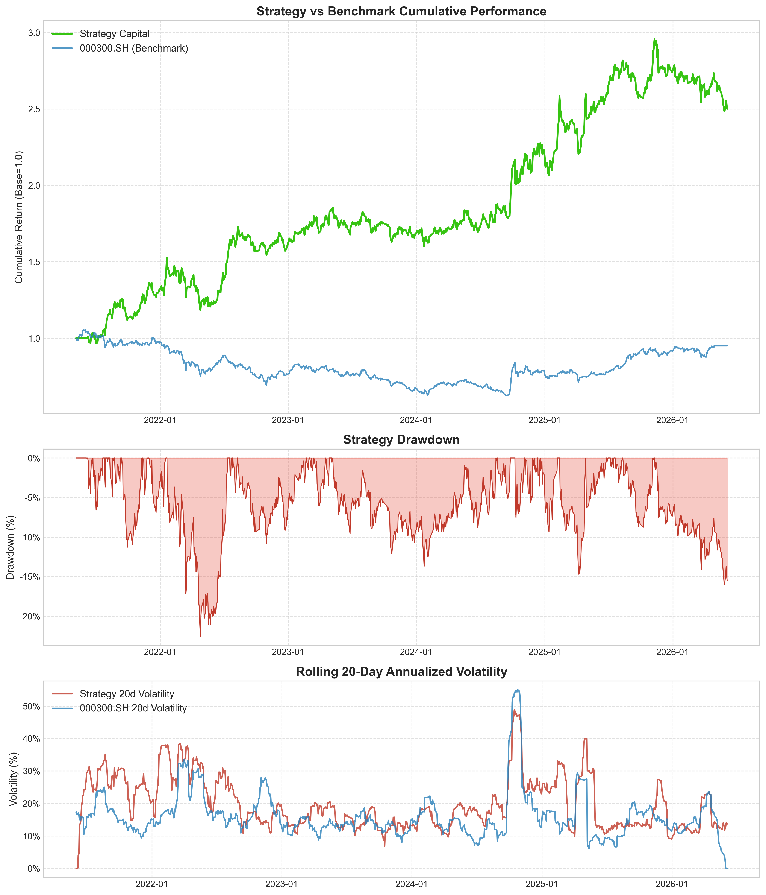

# StockPickingSystem 2.0 📈

[English](#english) | [中文](#中文)

### 📊 Visualization & Results




## English

### 🚀 Project Overview
StockPickingSystem 2.0 is an industrial-grade multi-factor stock picking and quantitative backtesting system tailored for the China A-share market. Following rigorous, production-level refactoring, the system implements a data-cleaning pipeline completely immune to look-ahead bias (future functions) and incorporates high-precision cross-sectional/time-series computation engines.
After eliminating all potential data leaks, cross-sectional duplicate anomalies, and implementing bulletproof panel-level split adjustments alongside an anchored "Time-Freeze" history filter, the strategy delivers a robust, look-ahead-free performance in trend-following mode: Total Return: 178.45%, Sharpe Ratio: 0.99, and Annualized Alpha: 25.89%.
### 🛡️ Production-Grade Features
* Panel-Level Split Adjustment: Eliminates price gaps and artificial cliffs (e.g., -90% flash crashes) common in cross-sectional merges via forward-filled global adjustment factors.
* Anchored Time-Freeze History Filtering: Abandons global size-based look-ahead tracking. It anchors history at a fixed date (e.g., 2025-05-26) and employs a rolling cumulative count (cumcount) thereafter. This locks past stock pools and guarantees that newly appended future data never retroactively alters historical backtest universes.
* Unified Time-Series Imputation: Executes comprehensive data imputation (handle_missing) right after multi-source alignment (align_panel), securing gaps from stock suspensions and industry index breaks.
* Self-Healing Factor Pipeline Audit: Integrates dynamic "infrared sensors" into the factor_pipeline. It catches row-splitting issues (such as the Sector factor multiplying rows due to historical sector changes) in real-time, executing automated deduplication.
### 📂 Repository Structure
```Plaintext
├── config/                  # Pathing and global configurations
├── data/                    # Data Center (Parquet/CSV)
│   ├── raw/                 # Raw daily bars, adjustment factors, SW industries, index data
│   ├── clean/               # Gold-standard clean, adjusted, and aligned panel data
│   └── factors/             # Computed factors, Alpha scores, and daily buy lists
├── data_engine/             # Data cleaning and alignment engine
│   └── clean/               # Core steps (clean_prices, forward_adj, missing_handler, etc.)
├── factor_engine/           # Sub-factor workspaces (Momentum, Sector, ATR, Squeeze, etc.)
└── backtest/                # T+1 compounding rolling backtest engine
```
### ⚡ Quick Start
1. Data Cleaning & Base Panel Alignment
Run daily denoising, global split-adjustments, external data merging, time-series imputation, and anchored history filtering:
```bash
python data_engine/clean/run_clean_pipeline.py
```
3. Factor Pipeline & Self-Healing Audit
Compute the 9 core recipe factors while auditing and neutralizing any leaking/inflating sub-factors (e.g., Sector):

```bash

python factor_engine/run_factor_pipeline.py
```
3. Cross-Sectional Z-Score Combination
Perform cross-sectional normalization, blend multi-factor scores into alpha_score, and export today's actionable top picks:
```bash
python factor_engine/run_alpha_combiner.py
```
### 📊 Key Backtest Metrics (Trend Following Mode)
Total Return: 178.45%
Sharpe Ratio: 0.99
Max Drawdown: -22.70%
Win Rate: 48.05%
PnL Ratio: 2.39
Annual Alpha: 25.89%


## 中文

### 🚀 项目简介
`StockPickingSystem 2.0` 是一个面向 A 股市场的**工业级多因子选股与量化回测系统**。本项目经过严苛的工程级重构，建立了一套对“未来函数”完全免疫的数据清洗流，并内置了高精度截面/时序计算引擎。


策略在切断所有未来污染源、剔除截面分身、执行防弹级面板复权及上市天数时序滚动/时光冻结过滤后，在 trend-following 模式下交出了**总收益率 178.45%，夏普比率 0.99，年化 Alpha 25.89%** 的真实闭环成绩单。

### 🛡️ 核心硬核特性
* **防弹级全局面板复权**：彻底消灭了日截面拼接时因除权除息导致的价格断层（如 -90% 闪崩 Bug），顺着时间轴高精度前向填充。
* **时光冻结历史过滤**：摒弃传统的全局未来天数过滤，采用锚定特定时点（如 2025-05-26）并结合滚动累计计数（`cumcount`）的过滤机制，锁死历史收益，且未来追加数据绝不污染/篡改历史股票池。
* **多源数据终极合流与时序修复**：在全局长面板对齐（`align_panel`）后，集中执行缺失值时序填充（`handle_missing`），完美锁死个股停牌及行业指数断层。
* **因子流水线自愈审计系统**：在因子加工（`factor_pipeline`）中嵌入动态红外线传感器，实时拦截类似 `Sector` 因子因历史行业变更 merge 导致的个股行“细胞分裂（行膨胀）”Bug，自动脱敏去重。

### 📂 项目架构
```text
├── config/                  # 路径与全局配置
├── data/                    # 数据中心 (Parquet/CSV)
│   ├── raw/                 # 原始日线、复权因子、申万行业、指数数据
│   ├── clean/               # 经过去噪、复权、对齐后的金标面板数据
│   └── factors/             # 因子库、Alpha 总分及每日买入清单
├── data_engine/             # 数据清洗与对齐引擎
│   └── clean/               # 核心清洗步骤 (clean_prices, forward_adj, missing_handler等)
├── factor_engine/           # 独立子因子计算车间 (Momentum, Sector, ATR, Squeeze等)
└── backtest/                # T+1 复利滚动回测流水线
```
### 🔧 环境准备 (Installation)

在运行本项目前，请确保您的 Python 环境版本 $\ge 3.8$，并推荐在虚拟环境（`venv`）中运行。

#### 1. 创建并激活虚拟环境 (可选)
```bash
# 创建虚拟环境
python -m venv venv

# 激活虚拟环境 (MacOS/Linux)
source venv/bin/activate

# 激活虚拟环境 (Windows)
venv\Scripts\activate
```

### ⚡ 快速启动
1. 数据清洗与大面板构建
执行完整的单日清洗、全局复权、外部数据对齐、缺失值时序填充及时光冻结历史过滤：
```bash
python data_engine/clean/run_clean_pipeline.py
```
3. 阿尔法因子流水线生成（带自愈审计）
计算 9 大核心配方因子，实时审计并拦截膨胀内鬼（如 Sector 因子）：
```bash
python factor_engine/run_factor_pipeline.py
```
5. 横截面 Z-Score 阿尔法合成
对纯净因子执行截面标准化标准化，合成 alpha_score 并输出今日最新买入清单：
```bash
python factor_engine/run_alpha_combiner.py
```
### 📊 核心回测表现 (Trend Following Mode)
总收益率 (Total Return): 178.45%
夏普比率 (Sharpe Ratio): 0.99
最大回撤 (Max Drawdown): -22.70%
胜率 (Win Rate): 48.05%
盈亏比 (PnL Ratio): 2.39
年化超额 (Annual Alpha): 25.89%

